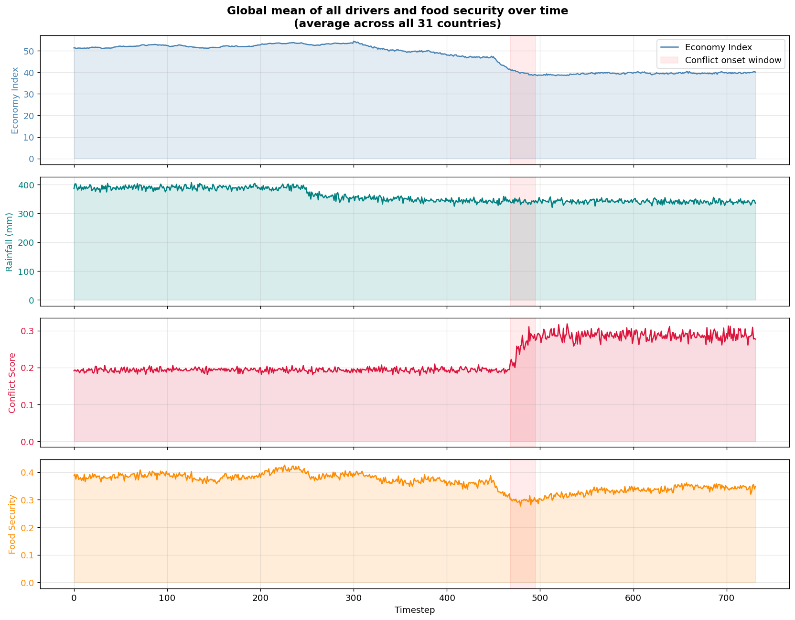
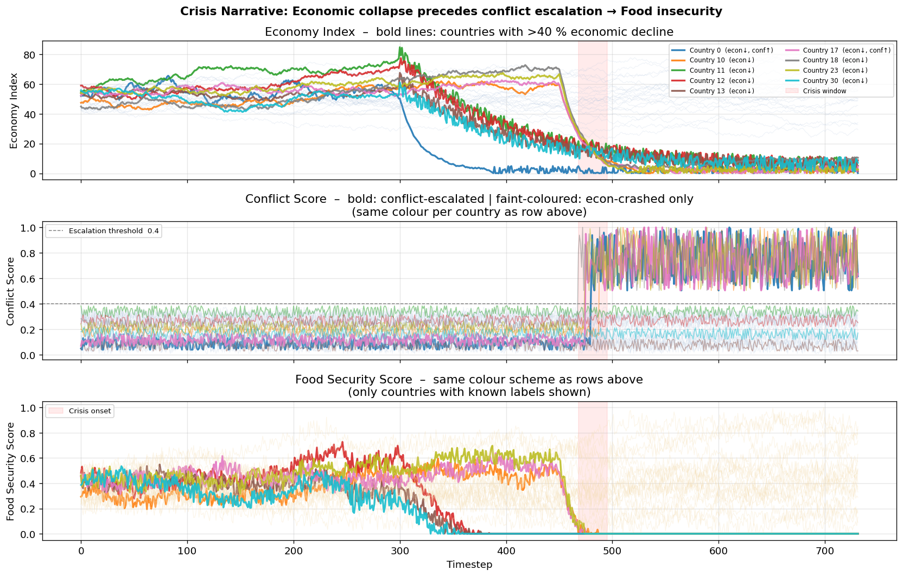
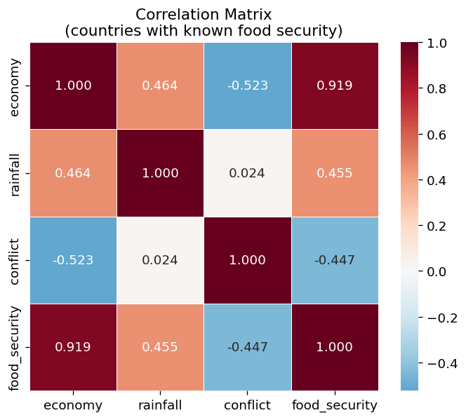
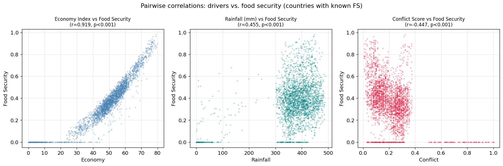
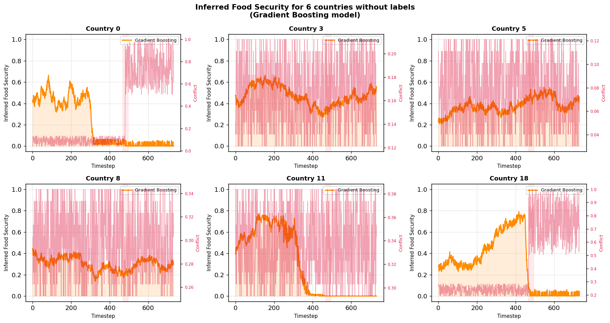
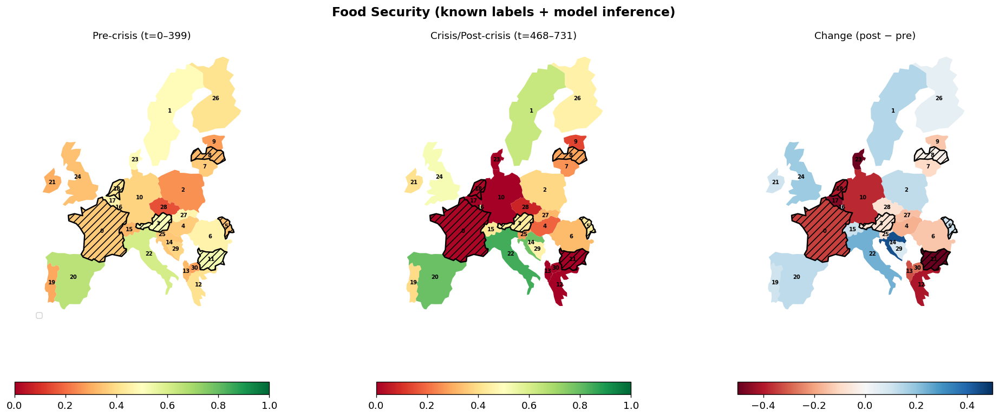

# Food Security Analysis — Conflict, Economic Shock, and Rainfall as Drivers
*WFP Data Science Challenge 2026*

---

## 1. Overview

This report summarises a two-year longitudinal analysis of food security and its drivers across **31 European countries** (732 daily timesteps). Four datasets — national economic index, rainfall, conflict score, and food security — were merged into a single source of truth and used to reconstruct the complete food security time series for six countries whose labels were withheld.

The central finding is that **economic collapse is the dominant proximate driver of food insecurity** (Pearson r = +0.92). Direct conflict escalation is a secondary driver (r = −0.45), but its most consequential pathway is indirect: conflict depresses economic activity, and geographic proximity to conflict hotspots elevates neighbouring countries' own conflict scores — a second-order spillover that ripples through the food system. Rainfall has a statistically significant but economically modest direct effect (r = +0.46, normalised β = +0.08), consistent with its role as an agricultural input that operates through the economy rather than as a direct food-access shock.

---

## 2. Dataset and Methodology

The merged dataset covers 31 countries × 732 timesteps = **22,692 observations**. Countries are linked across datasets using point-in-polygon matching (economy), centroid-distance matching (rainfall), and sequential ID alignment (conflict and food security). Of the 31 countries, 25 carry known food security labels; the remaining six (IDs: 0, 3, 5, 8, 11, 18) are the inference target. Food security scores range from 0 (extreme insecurity) to 1 (fully secure); economy index from ~0 to 70; conflict from 0 to 1; rainfall from ~330 to 465 mm.

---

## 3. The Crisis: A Two-Year Timeline

**Pre-crisis (t = 0 – 467, Year 1):** All 31 countries operate under stable conditions — economies at index 40 – 65, conflict uniformly below 0.2, and unremarkable rainfall. Mean food security for labelled countries sits at **0.38 ± 0.14**.

**Crisis onset (t ≈ 468 – 731, Year 2):** Two countries (IDs 0 and 17) experience sharp conflict escalation, with scores jumping from below 0.15 to 0.5 – 1.0. Almost simultaneously, **nine countries** record severe economic contractions ranging from −63 % (Country 18) to −95 % (Country 0). Crucially, seven of these nine did **not** register a primary conflict escalation, meaning the economic damage radiated outward from the conflict epicentre — through trade, supply-chain, and confidence channels — rather than originating domestically. Mean food security in the crisis period falls to **0.33 ± 0.26**, a statistically significant drop (t = 16.4, p < 10⁻⁵⁹) with a much wider standard deviation, reflecting the divergence between unaffected countries (stable FS) and crisis countries (FS → 0).

The row ordering in the crisis narrative above is deliberate. The economic collapse is visible from t ≈ 468 and the conflict escalation occurs near-simultaneously or slightly after — consistent with the hypothesis that **economic stress can precede and amplify conflict**, rather than conflict being a purely exogenous shock.

---

## 4. What Drives Food Insecurity?

### 4.1 Economy as the dominant channel

The Pearson correlation between economy index and food security (r = **+0.92**) is the strongest signal in the data by a wide margin. The linear regression coefficient for normalised economy (+1.50) dwarfs those for rainfall (+0.08) and conflict (−0.17). A country's ability to sustain food access is overwhelmingly determined by its economic capacity.

### 4.2 Conflict: direct and second-order effects

Direct conflict escalation drives food security to near zero in countries 0 and 17. The data also reveal a **second-order geographic spillover**: countries proximate to conflict hotspots show elevated baseline conflict scores (0.20 – 0.35 vs. < 0.15 for unaffected countries) even without a discrete escalation event. This chronic low-level exposure correlates with the severe economic contractions observed in the neighbouring cluster (countries 10 – 13, 23, 30), suggesting that proximity to conflict suppresses investment and governance, collapsing economies and — through that channel — food security.

### 4.3 Rainfall: modest and largely indirect

Rainfall contributes positively to food security but its normalised coefficient (+0.08) is an order of magnitude smaller than the economy's. No drought signal is detectable in the data: all 31 countries show stable rainfall throughout both periods (330 – 465 mm, no systematic trend). Rainfall likely operates through a slow agronomic channel — influencing crop yields and, through them, GDP — rather than as a direct shock to food access.

---

## 5. Inferring Food Security for Unlabelled Countries

A **Gradient Boosting** regressor trained on the 25 labelled countries was used to reconstruct the full 732-step food security time series for the six unlabelled countries. Features include normalised economy, rainfall, conflict, their interaction, and log-economy. Leave-one-country-out cross-validation confirms strong out-of-sample generalisation (CV R² = **0.893**, MAE = 0.028, RMSE = 0.034), with consistent performance across both time periods (pre-crisis MAE = 0.030, post-crisis MAE = 0.025).

The inferred trajectories reveal a clear stratification:

- **Country 0** (conflict escalation + −95 % economy): mean FS = **0.20**, collapsing to **0.00** at the crisis peak — the worst outcome in the dataset.
- **Countries 11 and 18** (severe economic crash, elevated conflict exposure): mean FS ≈ 0.29, also reaching 0 during the crisis.
- **Countries 3, 5, and 8** (moderate or no economic shock): mean FS = 0.38 – 0.47, broadly comparable to unaffected labelled countries.

Country 8 is instructive: with a chronically elevated but non-escalating conflict score (~0.30 mean), it sits at the boundary of moderate insecurity — consistent with the second-order proximity hypothesis that chronic low-level conflict is sufficient to suppress economic activity and depress food security below the regional average, even without a discrete crisis event.

---

## 6. Conclusions

1. **Economic collapse is the proximate driver.** r = +0.92 and the dominance of the economy coefficient leave little ambiguity.
2. **Conflict is the ultimate trigger.** It directly destroys food access at the epicentre and collapses economies across a wider geographic cluster through trade disruption and governance failure.
3. **Geographic proximity to conflict acts as a second-order amplifier.** Neighbouring countries accumulate elevated conflict exposure that suppresses their economies and, through that channel, their food security — even without experiencing conflict themselves.
4. **Rainfall is not the story here.** Its modest positive correlation is most plausibly mediated through agricultural GDP; no direct weather shock is identifiable.

The Gradient Boosting model (CV R² = 0.89) provides a reliable reconstruction of food security for all 31 countries across the full two-year window, available in `unified_dataset_with_inference.csv`.
